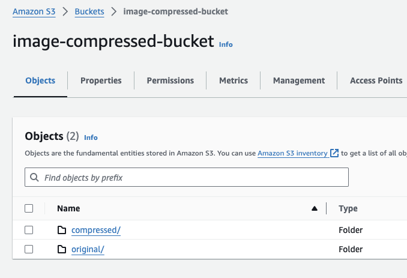
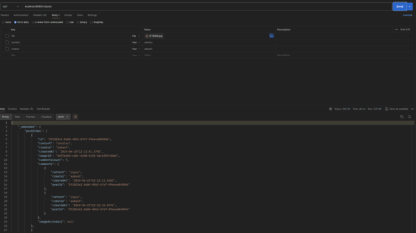

# Content Server 

### Reference Documentation
* Please refer to [Production.md](Production.md) for the details about what should be done in order to ship it on production
* Please refer to [ServiceDescription.md](ServiceDescription.md) for the details on class hierarchy and API endpoints.
* This project is a Spring Boot application that uses the following technologies:
  * Java 21 
  * Spring Boot 3.3.1
  * Spring Data MongoDB - To connect to MongoDB instance
  * Spring HATEOAS - For cursor based pagination
  * Quartz Scheduler - To schedule cleanup jobs to delete original images to S3.
  * Spring Web - Web Framework
  * Spring Boot Maven Plugin
  * Spring Boot Actuator - To monitor the application
  * Spring Boot AOP - For logging and exception handling
  * Distributed Tracing - To track api calls across services.
  * Resilience4J - For Circuit Breaker and RateLimiter. 
  * Micrometer - For tracing.
  * Modelmapper - To map entities to DTOs.
  * AWS SDK - To upload files to S3. I've implemented multipart upload to S3.
  * MongoDB - For database. I've using a single instance of MongoDB for this project. In a production env, a replicaset
   should be used with primary-secondary architecture. We can discuss whether to have an in-sync or async replication.
  * If not using Spring, we'll have to setup factory methods to create the instances for different services.
* The image is served in a separate /image endpoint. The idea behind this was that the image can fetched only when required. The GET /post/{postId} endpoint returns the image link 
  which can be used to fetch the image. This helps to decouple the image from the data.
* The service was designed based on the principles of Domain-Driven Design (DDD) and Clean Architecture.
* The service has RESTful API that provides endpoints to creat a post with pictures and captions. Users can also add comments to the posts.
* All configurations are available in the configurations package.
* Jakarta validation annotations have been added to entity fields for request validation.
* @Indexed annotation has been added to the id field for faster retrieval.
* CacheControl config has been added for the GET endpoints.

### Running the application
* The application can be run using the following command:
  * `mvn clean install` to build the application
  * `mvn spring-boot:run` to run the application
  * Additionally, the application can be run using the jar file created in the target folder.
    * `java -jar target/content-server-0.0.1-SNAPSHOT.jar`
  * The application runs on port 8080 by default. The port can be changed in the application.yml file.
  * The application can be accessed at http://localhost:8080/v1/
  * The repo can be imported into any IDE and run as a Spring Boot application.
  * 
### Functional requirements:
  * As a user, I should be able to create posts with images (1 post - 1 image) => Implemented
  * As a user, I should be able to set a text caption when I create a post => Implemented
  * As a user, I should be able to comment on a post => Implemented
  * As a user, I should be able to delete a comment (created by me) from a post => Implemented
  * As a user, I should be able to get the list of all posts along with the last 2 comments on each post => Implemented
  * RESTful Web API (JSON) => Implemented
  * Maximum image size - 100MB  => Implemented in application.yml
  * Allowed image formats: .png, .jpg, .bmp. => Implemented
  * Save uploaded images in the original format => Implemented
  * Convert uploaded images to .jpg format and resize to 600x600 => Implemented
  * Serve images only in .jpg format => Implemented
  * Posts should be sorted by the number of comments (desc) => Implemented
  * Retrieve posts via a cursor-based pagination => Implemented
  * The image can be access by using the link in the GET /post/{postId} request.
  * The images are saved on an S3 bucket created by me. So the POST /post api would fail as the creds are stored in my machine. Please feel free to ask for the creds.

##### Note: The image configuration has been stored in resize_config.json in the resources folder by their content (post,comment ) type

### Non-functional requirements:
  * Maximum response time for any API call except uploading image files - 50 ms
    * The response time recorded for all APIs on Postman is less than 50 ms, including the upload image API. The image is uploaded asynchronously to S3.
    * Only the API to get the actual image from S3 takes more time as it depends on the file size.
    * 
    * For the requirement "I should be able to get the list of all posts along with the last 2 comments on each post", 
      the avg response time is around 48 ms.
    * 
  * Minimum throughput handled by the system - 100 RPS - Implemented in the application.yaml under tomcat config
  * Users have a slow and unstable internet connection - Checked with 100 Mbps connection. Didn't replicate slow and unstable connection to test.

    