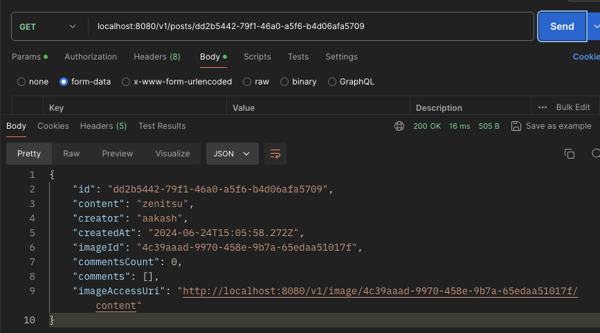
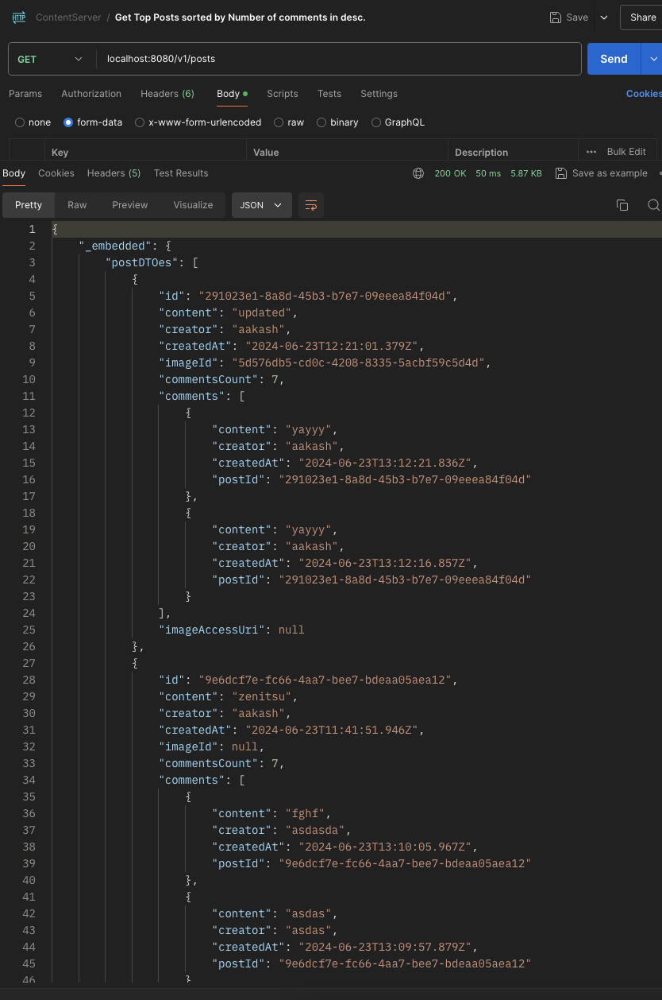
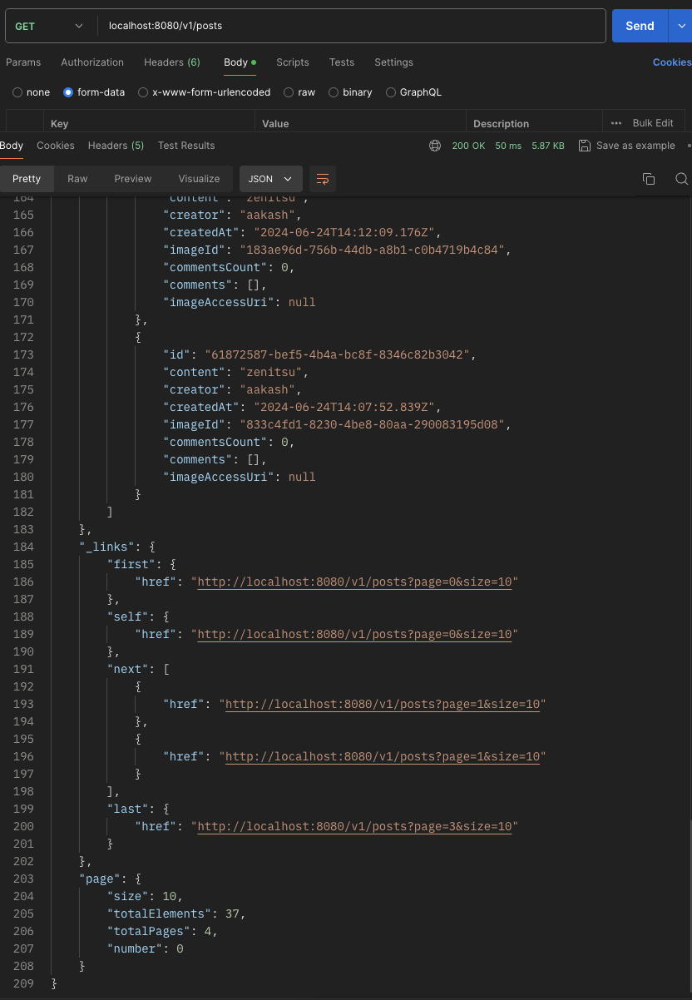
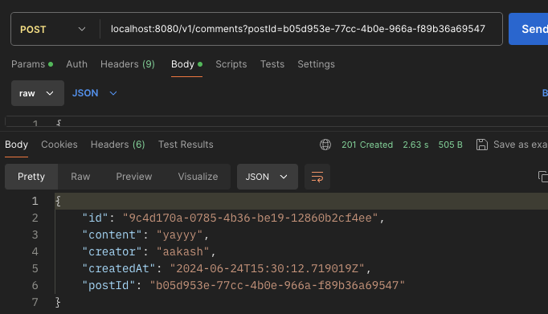
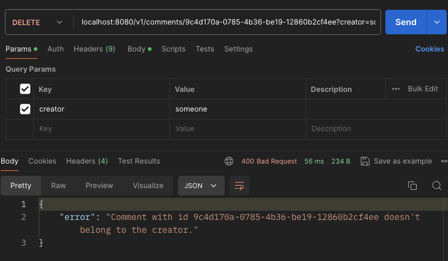
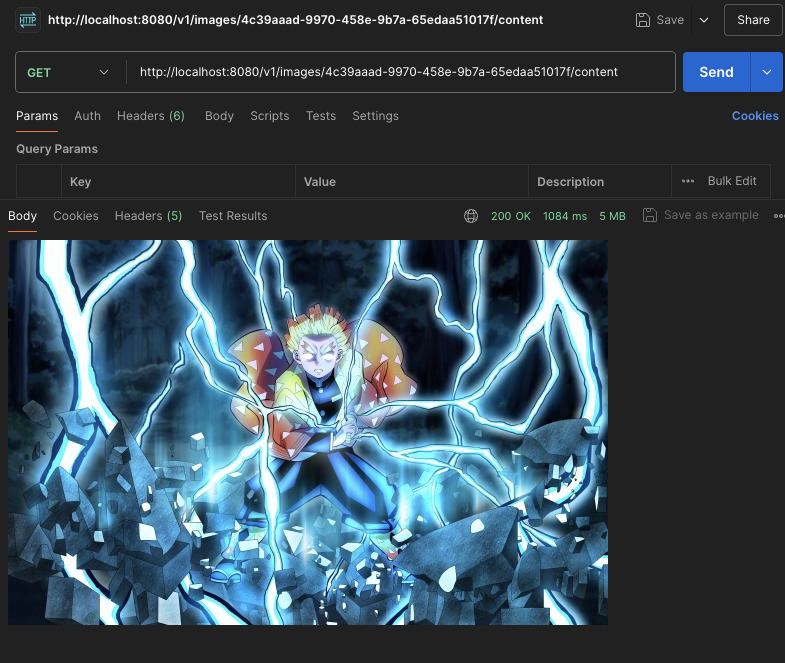

#### Class Hierarchy

* Entities 
  * Content - parent class for Post and Comment entities
    * Post - Used to save post details
    * Comment - Used to save Comment for the post id
  * FileType - abstract parent class. Use dto save the file type details
    * Image - Used to save Image entity associated with the post id
* DTOs
  * ContentDTO - parent class for PostDTO and CommentDTO
    * PostDTO - Used to map to the Post entity
    * CommentDTO - Used to map to the Comment entity
  * FileTypeDTO - abstract parent class
    * ImageDTO - Used to map to the Image entity
* Repositories
  * ContentRepository - parent interface to provide common functionality for Post and comment entities.
    * PostRepository - CRUD repo for Post entity
    * CommentRepository - CRUD repo for Comment entity
  * FileTypeRepository - parent interface for FileType entity
    * ImageRepository - CRUD repo for Image entity
* Interfaces
  * ImageFunctions -
    * ImageFunctionsImpl - Implementation of ImageFunctions
  * FileSupportedType - Interface to provide supported file types
    * ImageSupportedType - Implementation of FileSupportedTypes
  * ImageResizeConfiguration - Interface to provide image resize configuration
    * ImageResizeConfigurationImpl - Implementation of ImageResizeConfiguration
  * S3Processor - Interface to provide S3 operations
    * S3ProcessorImpl - Implementation of S3Processor
* Services
  * ContentService - parent class for PostService and CommentService containing common beans
    * PostService - Service class for handling Post entity
    * CommentService - Service class for handling Comment entity
  * FileTypeService
    * ImageService - Service class for handling Image entity

#### API Endpoints
Postman Collection - https://api.postman.com/collections/7922059-48e27b7f-0ec1-4fab-9fba-0910f464f8fe?access_key=PMAT-01J16ZGAYCGY4CJH4CRNMKMZ1E
* Controllers
  * PostController - Controller class that provides APIs for Post entity
    * baseUrl: /v1
    * **/posts** -curl --location --request POST 'localhost:8080/v1/posts' \
      --form 'file=@"/Users/aakash.chauhan/Downloads/1213906.jpg"' \
      --form 'content="happy friday"' \
      --form 'creator="aakash"'
      * creates the post for the user
      * uploads the original image to S3 at /original prefix
      * resizes the image to 600x600, converts to jpg and uploads to S3 /compressed
      * do a GET call on the post id to get the image location.
      * API returns 201 created on successful post creation.
      * API gives 400 if the payload is not correct.
    * **/posts/{postId}** -curl --location --request GET 'localhost:8080/v1/posts/1'
      * Returns the post with the postId
      * The image can be accessed by the link in the response
      * API returns 200  on successful get.
      * 
    * **/posts** curl --location --request GET 'localhost:8080/v1/posts'
      * Returns all the posts sorted by comments count desc with the last 2 comments.
      * The response has cursor based pagination. Navigation links are provided in the response.
      * 
      * 
    * **/posts/{postId}** -curl --location --request PUT 'localhost:8080/v1/posts/1?caption=updated'
      * Updates the caption of the post
      * creator cannot be updated
    * **/posts/{postId}/comments** -curl --location --request GET 'localhost:8080/v1/posts/1/comments'
      * Gets all comments for the post.
    * **/posts/all** -curl --location --request GET 'localhost:8080/v1/posts/all' \
      * Gets all created posts. 10 posts per page.
  * CommentController
    * baseUrl: /v1
      * **/comments** curl --location 'localhost:8080/v1/comment?postId=b05d953e-77cc-4b0e-966a-f89b36a69547'
        --header 'Content-Type: application/json' \
        --data '{
        "content" :"i have to work now",
        "creator" : "aakash"
        }'
        * Creates a comment for the postId mentioned in the query params.
        * The response also contains the associated postId
        * 
      * **/comments/{commentId}** -curl --location --request GET 'localhost:8080/v1/comments/1'
        * Returns the comment with the commentId
      * **/comments/{commentId}** curl --location --request DELETE 'localhost:8080/v1/comment/b2cb5877-a940-4205-9383-e00a4ff54353?creator=aakash'
        * Deletes the comment with the commentId if the  creator mentioned in the query params matches with the creator of the commentId.
        * Returns 400 bad request if the creator doesn't match.
        * Returns 204 after on successful delete.
        * 
  * ImageController
    * baseUrl: /v1
      * **/images/{imageId}** -curl --location --request GET 'localhost:8080/v1/images/1'
        * Returns the image with the imageId
      * **/images/{imagesId}/content** -curl --location --request GET 'localhost:8080/v1/images/1/content'
        * Returns a byte array of the image. Hit the api in Postman/Browser to see the image.
        * 
